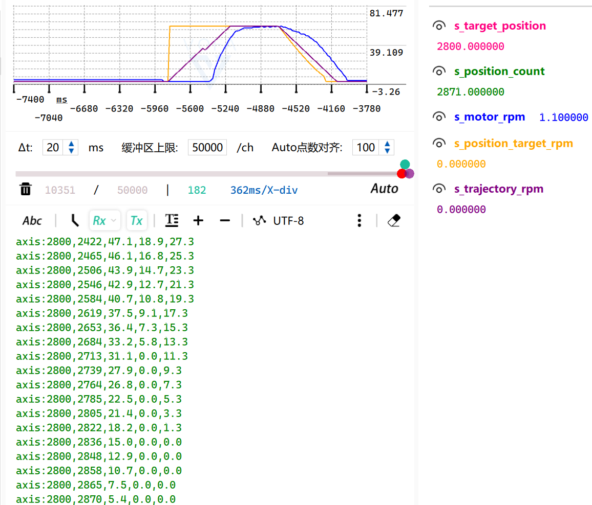
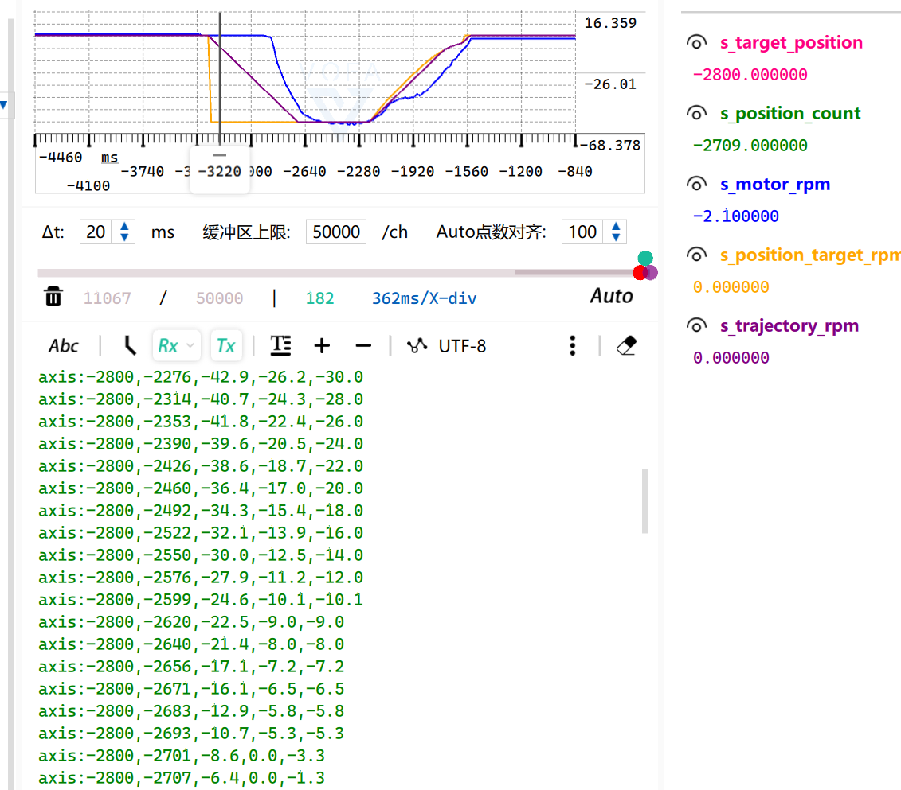

# Project25 单轴闭环运动控制节点

## 1. 项目简介

基于 STM32F103、FreeRTOS、N20 有刷减速电机、AB 增量式 Encoder 与 DRV8833 的单轴闭环运动控制项目。

当前版本聚焦一条完整且可阅读的控制链路：Encoder 反馈、Speed Control、相对位置控制、Acceleration-Limited Trajectory、Motion State Machine，以及初步的 Homing / Fault 流程。

## 2. 当前状态

**Work in Progress**

### 已上板观察验证

- Feedforward、Speed P 与 Speed PI
- Integral Limit 与 Conditional Anti-Windup
- `+80 RPM` / `-80 RPM` 双向速度闭环
- Stop Response 与轻微手动负载扰动恢复
- Position P -> Trajectory -> Speed PI 串级控制
- 20 ms 周期的 Acceleration-Limited Trajectory：最大 `60 RPM`，最大加速度 `100 RPM/s`
- `±700`、`±1400`、`±2800 Count` 相对定位；最终均进入配置的 `±100 Count` 容差
- 当前机构的 `+2800 Count` 验证最终停在 `2871 Count`，误差 `+71 Count`
- 当前机构的 `-2800 Count` 验证最终停在 `-2709 Count`，误差 `+91 Count`
- `HOME_SIM` Homing 软件状态机，以及 Homing 10 秒超时 -> `FAULT`
- 未 Homed 时拒绝位置命令，并报告 `FAULT_NOT_HOMED`
- Software Position Limit、Fault 停机与显式 Fault Reset
- Motion Command / Status API，外部模块不能直接控制 PWM 或修改内部状态

### 下一步

- 真实 KW11 Mechanical Homing
- Homing Repeatability
- Hardware Limit
- 根据真实机械行程确定最终 Software Position Limit

### 尚未完成真实机械验证

- KW11 Mechanical Homing
- Homing Repeatability
- Hardware Limit
- Final Mechanical Zero Reference

`HOME_SIM` 是用于验证软件状态机路径的板载输入，不代表最终机械 Homing 的重复精度。

## 3. 控制架构

```text
Position Controller
        |
        v
Trajectory / Acceleration Limit
        |
        v
Speed PI + Feedforward
        |
        v
Motor Driver
        |
        v
N20 Motor + Encoder Feedback
```

`motion.c` 是唯一允许写入 PWM 的模块。`controller.c` 负责 Speed PI、Position Controller、Feedforward、Integral Limit、Conditional Anti-Windup 与 Trajectory 计算；FreeRTOS 任务每 20 ms 调用一次 `Motion_Update()`。

### FreeRTOS 在当前版本中的作用

当前固件只有一个核心业务任务 `Motion_Task`，任务循环只负责每 20 ms 调用一次 `Motion_Update()`。现有控制功能也可以使用裸机定时调度实现，FreeRTOS 在本项目中不是控制算法成立的必要条件；当前主要用于提供稳定的周期执行环境，并提前建立未来通信任务与 Motion Command API 之间的职责边界。

## 4. Motion State Machine

```text
INIT -> IDLE -> READY
                  |  \
                  |   \ position command
                  |    -> RUN_POSITION -> READY
                  |
                  +---- home command -> HOMING -> READY
                                           |
                                           +-- timeout -> FAULT
```

进入 `FAULT` 后 PWM 被关闭，系统不会自动继续故障前的命令。当前 Homing 使用 `HOME_SIM` 验证状态机；真实限位开关行为仍待验证。

## 5. 实机验证

### 早期模块验证

以下两张图记录了速度控制开发阶段的实机验证，用于证明 Speed PI 和 Conditional Anti-Windup 模块已经完成验证；它们不表示当前 20 ms 周期下重新采集的数据。

| 证据 | 支持的结论 |
| --- | --- |
|  | Speed PI 闭环响应 |
|  | Conditional Anti-Windup 行为 |

### 当前 20 ms 综合验证

以下两张图在当前机械装配与 20 ms 控制周期下采集，展示 Position Controller -> Trajectory -> Speed PI 的正反向完整控制链路。

| 证据 | 支持的结论 |
| --- | --- |
|  | `+2800 Count`：Trajectory 平滑加减速，最终误差 `+71 Count` |
|  | `-2800 Count`：反向 Trajectory 与位置闭环，最终误差 `+91 Count` |

`speed_pi_restart_overshoot_pre_anti_windup.png` 保留在 `docs/images`，用于工程过程对照，不作为 README 主验证图。

## 6. 硬件 / 软件环境

- MCU：STM32F103ZET6
- RTOS：FreeRTOS + CMSIS-RTOS2
- Motor Driver：DRV8833，TIM3 PWM（PA6 / PA7）
- Encoder：TIM4 Encoder Mode（PD12 / PD13）
- Homing 模拟输入：PA0（`HOME_SIM`）
- 调试串口：USART1，115200 bps
- 运动控制周期：20 ms
- 工具：STM32CubeMX、STM32CubeIDE、Git

## 7. 仓库结构

```text
Firmware/
  Core/Src/freertos.c      FreeRTOS 任务创建与周期调度
  Core/Src/motion.c        状态机、Homing、Encoder/PWM 运动流程
  Core/Src/controller.c    Feedforward、PI、Position P、Trajectory
  Core/Inc/motion.h        Motion Command / Status 公共接口
  Core/Inc/                其余模块头文件与 CubeMX 生成头文件
docs/
  design.md                设计说明与当前边界
  images/                  已筛选的验证证据
```

## 8. 当前限制与后续计划

Project25 当前仍以完成运动控制节点核心闭环为目标。

当前机械装配下的低速 Feedforward 标定边界点约为 `2150 PWM / 42 RPM`。低于该速度区间的 Feedforward 采用平滑插值，避免低速段直接施加大 PWM；该标定关系仅适用于当前 N20、法兰轮毂和摇臂装配状态。

### 近期收口

- 真实 KW11 Mechanical Homing
- Homing Repeatability
- KW11 Hardware Limit
- 真实 Mechanical Zero Reference

### 可选扩展

- 轻量 Command Interface
- Modbus RTU
- Parameter Persistence
- IWDG / Task Monitor
- 更完整的 Fault Diagnostics

更多设计边界见 [docs/design.md](docs/design.md)。
